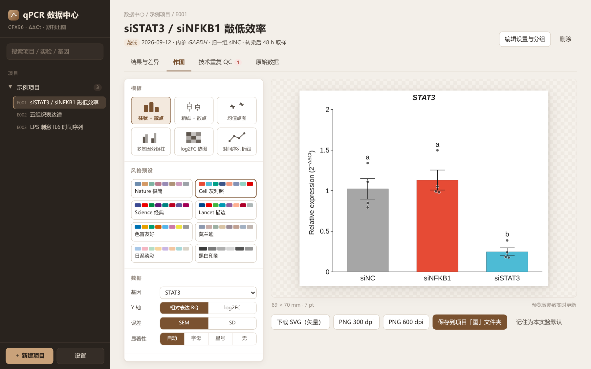
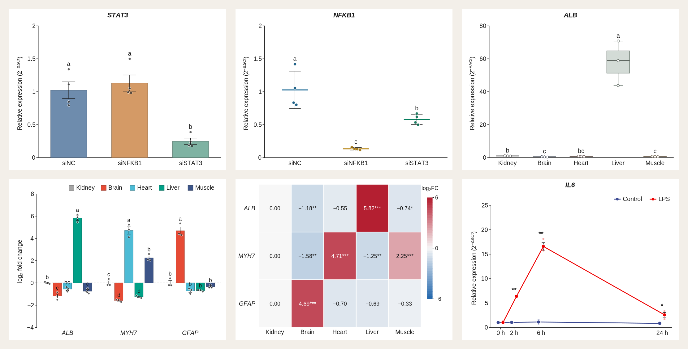
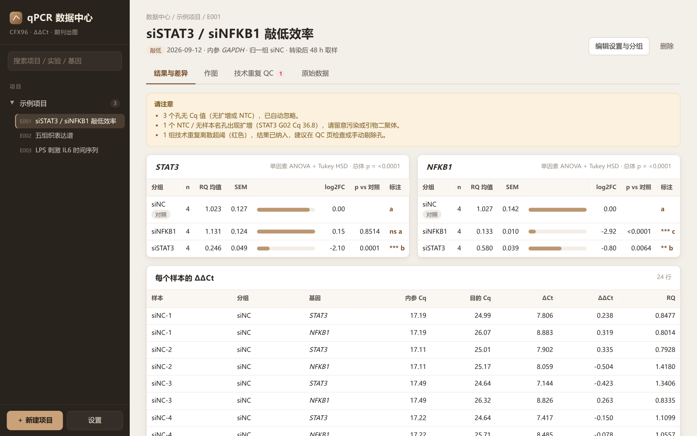
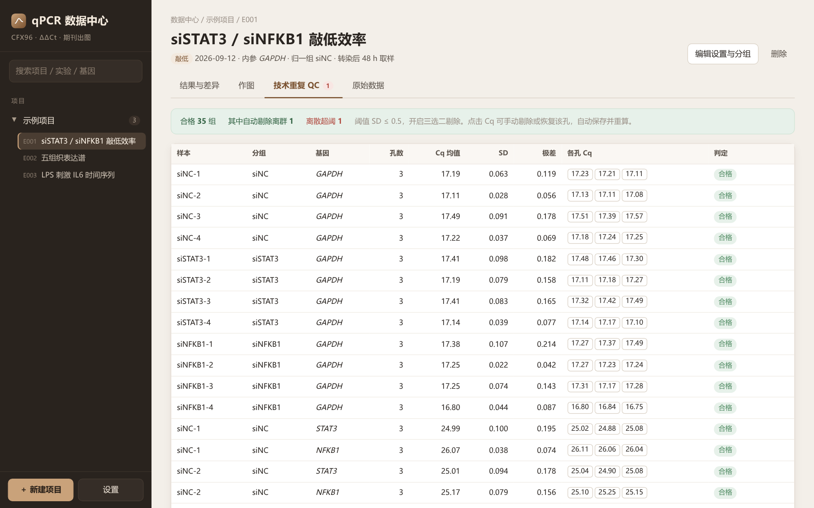
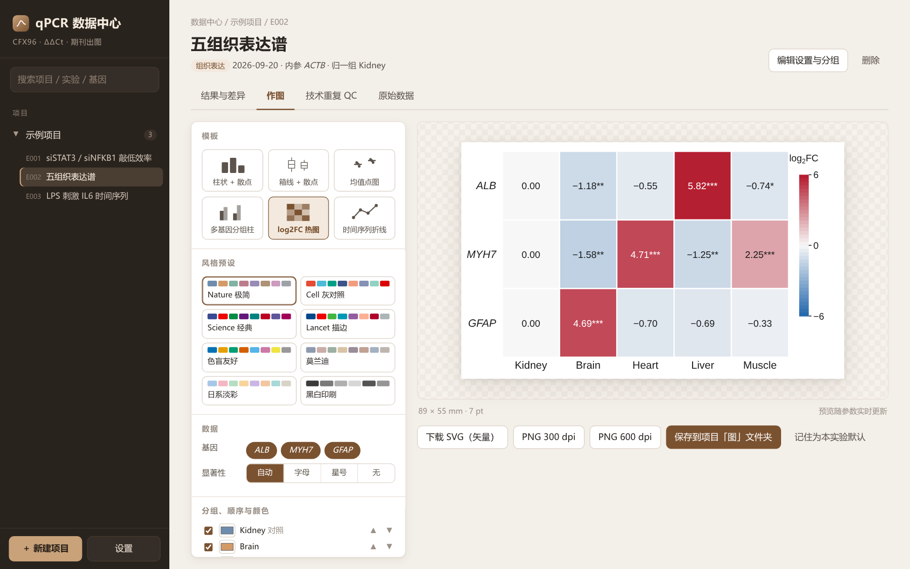
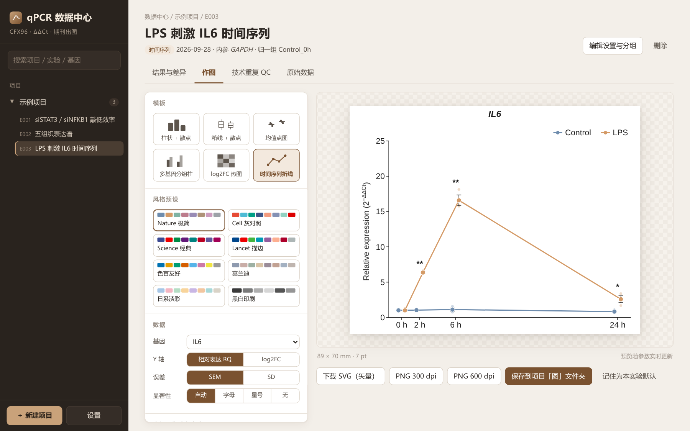

# qPCR 数据中心

**CFX96 荧光定量结果的本地数据中心**：按项目归档，自动完成技术重复质控、ΔΔCt 相对定量与差异检验，用期刊模板出图，所有数据存成 Excel。

A local-first data hub for Bio-Rad CFX96 qPCR exports. It organizes runs by project, performs replicate QC, ΔΔCt relative quantification, and statistical testing, and renders journal-style figures. Everything is stored in plain Excel workbooks. Pure Python standard library, zero third-party dependencies, shipped as a single Windows exe.



## 下载

到 [Releases](../../releases) 下载 `qPCR-Data-Center.exe`，双击即用，不需要安装 Python。同一页面的 `example-data.zip` 是示例数据，可以拿来试用。

首次打开如果弹出「Windows 已保护你的电脑」，点「更多信息」再点「仍要运行」（程序没有购买代码签名证书）。

## 功能

- **按项目和实验内容分类**：左栏项目树，实验卡片按「实验内容」筛选，可按项目、实验、基因名搜索。
- **导入 CFX 导出**：Quantification Summary / Cq Results，xlsx 与 csv 均可。内参板与目的基因板分开跑也能按「样本 × 基因」自动合并。CFX 未填 Target 时可在导入时改基因名。
- **技术重复 QC**：复孔 SD 或极差阈值判定，三选二自动剔除离群孔，点击任意 Cq 手动剔除或恢复。NTC 出现扩增时单独提醒。
- **ΔΔCt 与差异检验**：2 组用 Welch t 检验，3 组及以上用单因素 ANOVA + Tukey HSD，星号与字母法两种标注。统计内核与 scipy 对拍到机器精度。
- **六个出图模板**：柱状 + 散点、箱线 + 散点、均值点图、多基因分组柱、log2FC 热图、时间序列折线。
- **配色**：8 个一键风格预设，10 套配色，5 套热图色带，每个分组颜色单独可调，对照组可一键设灰。
- **期刊尺寸**：单栏 89 mm、1.5 栏 120 mm、双栏 183 mm，字号以 pt 计。导出 SVG 矢量或 300 / 600 dpi PNG。
- **Excel 存储**：每个项目一个 xlsx。原始孔、样本分组等真值表可以直接在 Excel 里改，回到程序重新打开即重算。每次保存自动备份旧版。



<table>
<tr><td></td><td></td></tr>
<tr><td></td><td></td></tr>
</table>

## 示例数据

[`示例数据/`](示例数据) 是按 CFX Maestro 导出格式生成的**模拟数据**，不对应任何真实实验，由 `make_examples.py` 以固定随机种子生成：

| 文件 | 场景 | 内参 | 归一组 |
|---|---|---|---|
| `01_siRNA敲低_*.xlsx`（2 块板） | siSTAT3 / siNFKB1 敲低效率，含离群孔、离散组与 NTC 扩增 | GAPDH | siNC |
| `02_组织表达谱_*.csv`（2 块板） | 肝、心、脑、肾、肌肉五组织 × 三基因表达谱 | ACTB | Kidney |
| `03_时间序列_*.xlsx`（2 块板） | Control 与 LPS 刺激后 IL6 在 0 / 2 / 6 / 24 h | GAPDH | Control_0h |

时间序列示例导入后，在「分组设置」里给各组填上时间点（0 h、2 h…）和系列（Control、LPS），再选「时间序列折线」模板。

## 数据存在哪

默认在 `我的文档\qPCR数据库\`，可在「设置」中修改。每个项目一个文件夹，内含同名 xlsx 总表、`原始文件/`（导入时归档的 CFX 原文件）、`图/`（导出的图）和 `.备份/`（最近 20 份历史版本）。

## 计算口径

- ΔCt = Cq(目的) − Cq(内参)，ΔΔCt = ΔCt − mean(ΔCt 归一组)，RQ = 2^(−ΔΔCt)
- log2FC = −mean(ΔΔCt)，即组内 RQ 几何均值的 log2
- 显著性检验默认在 ΔCt 上进行（可切换为 RQ），字母法中 a 给 RQ 最高的组
- 星号：* p<0.05，** p<0.01，*** p<0.001

## 从源码运行

需要 Python 3（已在 3.12、3.13 上测试），无第三方依赖。

```bash
python qpcr_server.py            # 启动并自动打开浏览器
python -m unittest discover -s tests
```

Windows 下双击 `打包成exe.bat` 即可用 PyInstaller 打成单个 exe。

| 文件 | 作用 |
|---|---|
| `qpcr_server.py` | 入口，本地 HTTP 服务（只监听 127.0.0.1） |
| `qpcr_core.py` | CFX 解析、统计内核、ΔΔCt、xlsx 读写 |
| `qpcr_analysis.py` | 单个实验的完整分析 |
| `qpcr_store.py` | 项目 Excel 存储与备份 |
| `qpcr_plots.py` | 出图模板与配色预设（SVG） |
| `web/index.html` | 界面 |

更详细的操作说明见 [使用说明.md](使用说明.md)。

## License

MIT · 自动挡赛车手制作
